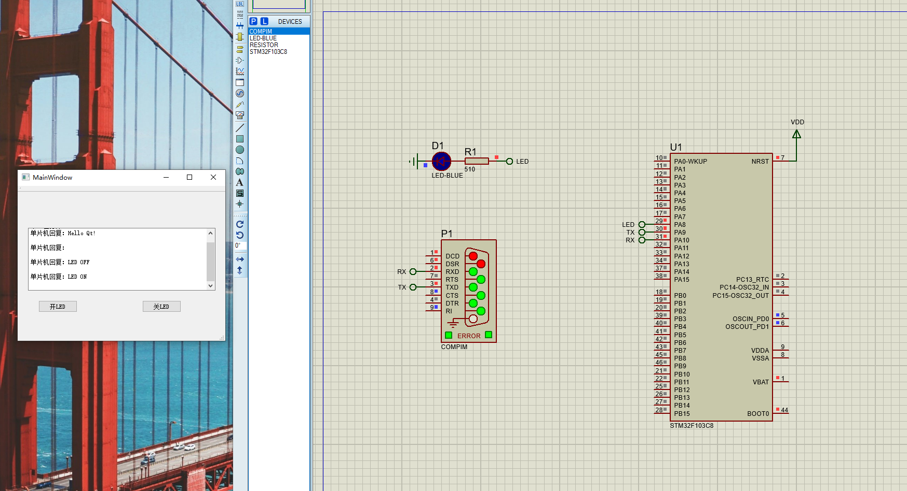

# QTSerialPort

#### 介绍
使用QT 虚拟端口 proteus keil实现上位机通过串口与仿真单片机进行通信，使LED灯开\关

#### 软件架构
软件架构说明

#### 安装教程

1.  QT  
    QT version：5.10.1  
    QT Creator version：4.5.1  
    使用 QT Creator打开QT目录下的项目文件linkProteus.pro  
2.  Launch Virtual Serial Port Driver  
    创建两个配对的虚拟串口 COM6 <-> COM7  
3.  Keil  
    Keil version: Keil uVision5 (stm32)  
    STM选型: STM32F103C8  
    标准外设库：STM32F10x_StdPeriph_Lib_V3.5.0  
    系统时钟频率：72MHz  
    output打开生成编译hex选项  
4.  Proteus
    Proteus version：8  
    打开proteus目录下的NewPProteus.pdsprj  
    确认stm32的OSC Frequency为72MHz，Program File为keil生成的hex文件  

#### 使用说明

1.  QT 运行程序
2.  Proteus开始仿真，如正确连接，则QT文本框中出现 hello QT，如没有出现需要检查是否正常连接，如乱码则检查串口配置是否是9600,8,N,1

3.  点击 开LED/关LED，观测仿真单片机是否控制LED实现开关功能

